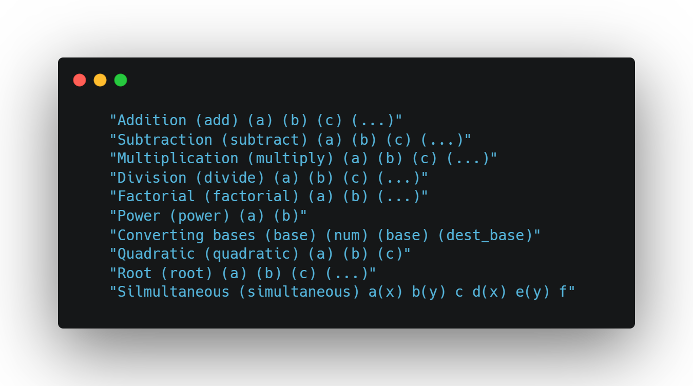

<h1 align="center">Calculator made with C</h1>

    

--------------------------------------------------------------------------------

### Libraries :scroll:
- stdio.h
- math.h
- [main.h](main.h)

-------------------------------------------------------------------------------

## [Calculator](calc.c) :desktop_computer:
```command line
This C progam functions as a calculator and performs 
some popular calculator arithmetic operations, 
as well as a few advanced ones. 
```



--------------------------------------------------------------------------------

### Running
>- For ubuntu systems (i.e sandbox or vagrant) run the executeable file
```commandline
 $- ./calculator {operation} {argument1 argument2 ...}
```
>- For others:
 Run the x.sh to compile the file for your machine, then run the executeable.
```commandline
 $ cat x.sh
 #!/bin/bash
 gcc calc.c -L. -lm -larithmetic -o calculator
 $ ./x.sh
 $ ./calculator {operation} {argument1 argument2 ...}
```

It may also be necessary to run full_compile.sh
```commandline
 $ cat full_compile.sh
 #!/bin/bash
 clear
 ls
 gcc -c addition.c converter.c division.c factorial.c multiplication.c powers.c quadratic.c root.c simultaneous.c subtraction.c
 ls
 sleep 2
 ar -rcs libarithmetic.a *.o
 rm *.o
 clear
 ls
 ar -t libarithmetic.a
 sleep 2
 gcc calc.c -L. -larithmetic -o calculator
 clear
 $ ./full_compile.sh
```

--------------------------------------------------------------------------------

### Input Rules
##### To input information, follow these rules.
- Do not use a wrong data type.
```commandline
 $ ./calculator root x
a
```
- Operations that require multiple input are seprated with a space.  
```commandline
 $ ./calculator add 2 3 4 5 6 7 8 9 0 13 53 75 86
```
- When a value is not specified as an argument, the program will exit with an error.  

--------------------------------------------------------------------------------

### Functions :computer:
>- [addition.c](addition.c):
 A function that adds numbers, can support 2 or more numbers to be added.  
 `./calculator add 2 3 4 5 ...`  
>- [division.c](division.c):
 A function that divides numbers. Numbers are divided using the first as numerator, and subsequent arguments are used to break it down. (i.e `$ ./calculator divide 100 10 2` divides 100 by 10, then the result by 2 to give 5.  
>- [multiplication.c](multiplication.c):
 A function that multiplies two or more numbers.  
 `./calculator multiply 2 3 4 5 ...`  
>- [subtraction.c](subtraction.c):
 A function that subtracts a numbers.  
 `./calculator subtract 131 13 12 56 1 ...`  
>- [factorial.c](factorial.c):
 A function that finds the factorial of a number(s).
 `./calculator factorial 2 3 4 5 ...`
>- [powers.c](powers.c):
 A function that finds the result of a number raised to the power of another.
 `./calculator power 2 3`
>- [silmultaneous.c](silmultaneous.c):
 A function that solves a silmultaneous equation.
 `./calculator simultaneous a b c d e f`  
>- [quadratic.c](quadratic.c):
 A function that solves a quadratic equation.  
 `./calculator quadratic a b c`
>- [converter.c](converter.c):
 Three functions that together convert from one base to another. (Only works for base 1-10)  
 `./calculator base num current_base destination_base`

--------------------------------------------------------------------------------

## :octocat: Undocumented Features :octocat:

>- Repetition in while loop
 (scanf, printf, last else statements){resolved}

```commandline
- Collect input(done), 
- Loop the exit and options(done, has extra features). 
- Also find a way to collect and store two return values (pending)
- Add last result (done, doesnt work for quadratic and simultaneous equations yet)
- x.sh for compiling faster
- Github actions
```

--------------------------------------------------------------------------------

<h2>✔Project Owner</h2>

<table>
  <tr>
  <td align="center"><a href="https://github.com/Jesulayomy"><br /><sub><b>Jesulayomy</b></sub></a></td>
  </tr>
</table>


--------------------------------------------------------------------------------

<h2>Contributors</h2>

<table>
  <tr>
  <td align="center"><a href="https://github.com/micoliser"><br /><sub><b>Micoliser</b></sub></a></td>

  <td align="center"><a href="https://github.com/Jesulayomy"><br /><sub><b>Jesulayomy</b></sub></a></td>
  </tr>
</table>


--------------------------------------------------------------------------------
Give a star if you liked this. You can join in the discussions section or contribute by contacting me
