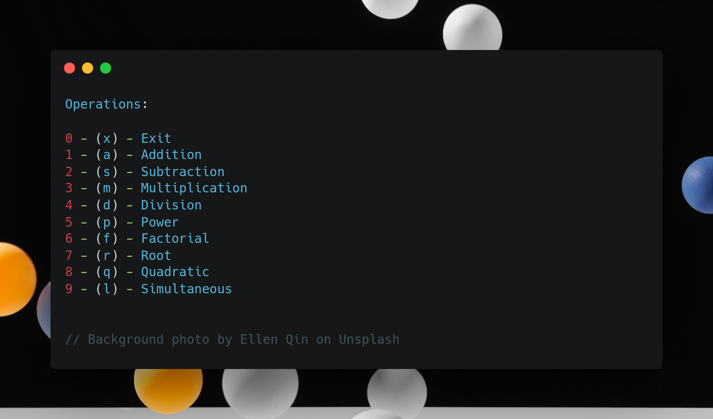

#	Calculator made in C

 

### Libraries :scroll:
- stdio.h
- [main.h](main.h)

## [Calculator](calc.c) :desktop_computer:
```command line
This progam functions as a calculator and performs the popular calculator arithmetic operations, 
as well as a few advanced ones.
```


### Running
>- For ubuntu systems (i.e sandbox) run the executeable file
```commandline
 $- ./calculator
```
>- For others:
 Run the x.sh to compile the file for your machine, then run the executeable.
```commandline
 $ ./x.sh
 $ ./calculator
```

### Input Rules
##### To input information, follow these rules.
- Do not enter more than the required amount of data.
```commandline
Enter a single digit number:
25
5
```

```commandline
Enter a single digit number:
7
```
- Do nor use a wrong data type.
```commandline
Input a number to find it's square root:
a
```
- Operations that require multiple input can be seprated with a space or entered one after the other.
```commandline
Enter three nunbers...
12 67 1
```

```commandline
Enter three numbers...
12
67
1
```
- When a value is not specified, the last value stored in memory is provided. This may lead to unexpected results.

### Functions :computer:
>- [addition.c](addition.c):
 A function that adds two numbers.
>- [division.c](division.c):
 A function that divides two numbers.
>- [multiplication.c](multiplication.c):
 A function that multiplies two numbers.
>- [subtraction.c](subtraction.c):
 A function that subtracts a number from another.
>- [factorial.c](factorial.c):
 A function that finds the factorial of a number.
>- [powers.c](powers.c):
 A function that finds the result of a number raised to the power of another.
>- [silmultaneous.c](silmultaneous.c):
 A function that solves a silmultaneous equation.
>- [quadratic.c](quadratic.c):
 A function that solves a quadratic equation.
>- [converter.c](converter.c):
 Three functions that together convert from one base to another. (Only works for base 1-10)

## :octocat: Undocumented Features :octocat:

>- Repetition in while loop
 (scanf, printf, last else statements){resolved}

```commandline
- Collect input(done), 
- Loop the exit and options(done, has extra features). 
- Also find a way to collect and store two return values (pending)
- Add last result (done, doesnt work for quadratic and simultaneous equations yet)
- x.sh for compiling faster
- Play around with Github actions
```
