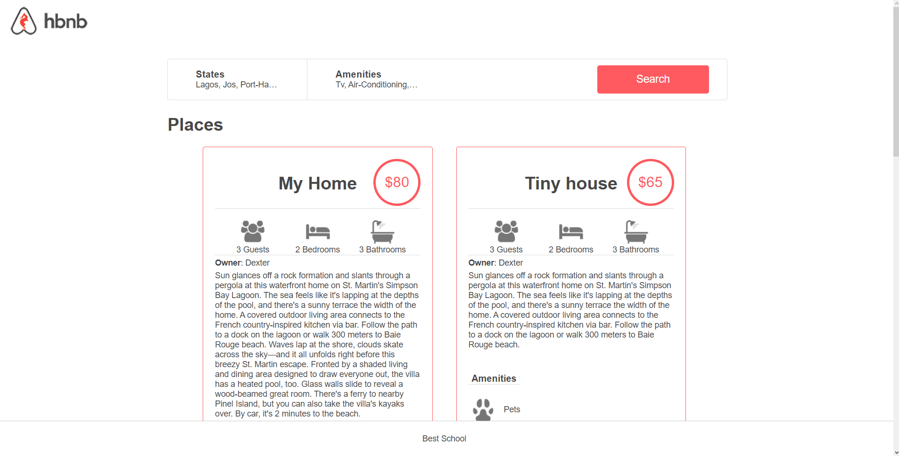
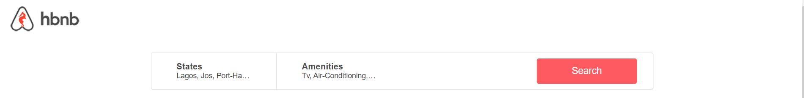
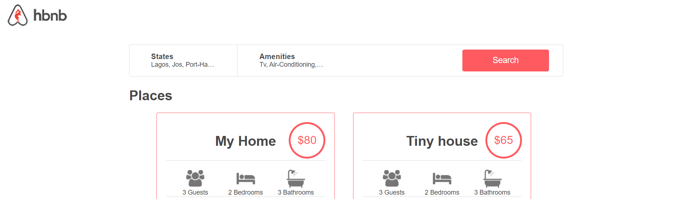
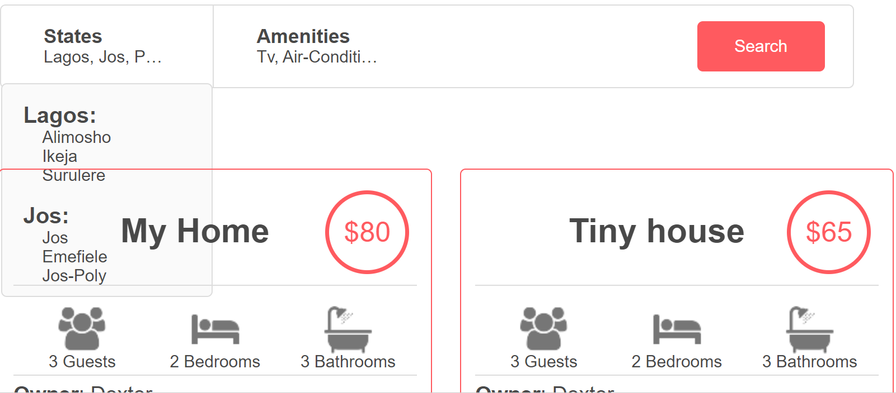

<h1 align="center"> :chart_with_downwards_trend: Real Time Stock Prices :chart_with_upwards_trend: </h1>

 

<section>
    <h2>Instructions</h2>
    <p>
    Using React or Vue.js, create a responsive dashboard that displays real-time stock prices from a 
    public api such as IEX Cloud ([[iexcloud.io](https://iexcloud.io/)])
    </p>
    <p>The dashboard should include a search bar that allows users to search for stock symbols, and the
    dashboard should display the current price, change in price, and percentage change for each stock.
    </p>
    <ul style="list-style-type: none; padding: 0px">
    <h3>Using:</h3>
    <li>Library: React Js</li>
    <li>Api: [IO Stock Exchange](https://iexcloud.io/)</li>
    <li></li>
    </ul>
</section>

<section>
<h2>Installation:</h2>
<p>The dashboard can be installed by cloning this repository to your terminal</p>
<p>With Git:</p>
```commandline
$ git clone https://github.com/micoliser/REPONAME.git
```

<p>Or using wget and unzip:</p>
```commandline
$ wget https://github.com/micoliser/REPONAME/archive/refs/heads/master.zip
```

<p>Then unzip the downloaded file</p>
```commandline
$ unzip master.zip
```

</section>

<section>
<h2>Usage:</h2>
<p>To use the dashboard, run the command; (Dashboard will be opened Default Browser)</p>
```commandline
$ cd REPONAME
$
$ npm start
$
```
</section>

---

<section>
<h2 align="center">The Dashboard</h2>

<p>
The dashboard is opened after running ```npm start``` from the terminal and
 displays the first 100 stocks by default.
</p>
<h4>The Dashboard search bar features</h4>
<p>
The dashboard search bar can be used to find a single stock, 
or multiple stocks seprated by commas (no spaces).<br>
It supports typing suggestions based on user input (first 50 stocks, completes text on click).<br>
Displays the first three results of the search.
</p>



<h4>Dashboard Results</h4>
<p>Dashboard results show the current price, change in price, and percentage change for each stock</p>
</section>

---

<section>
<h3>Bugs</h3>
<p>Cockroaches, termites and houseflies</p>
<p>Data takes approximately ten seconds to load. Chack your internet connection if loading persists</p>
</section>
